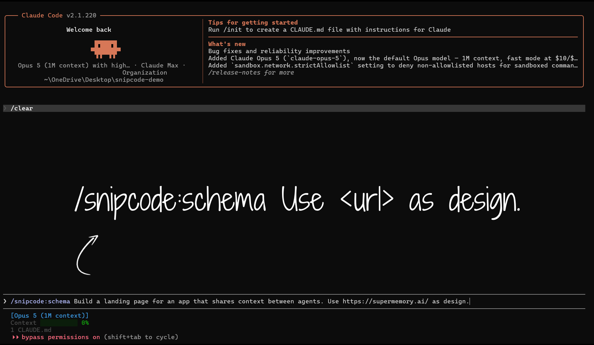
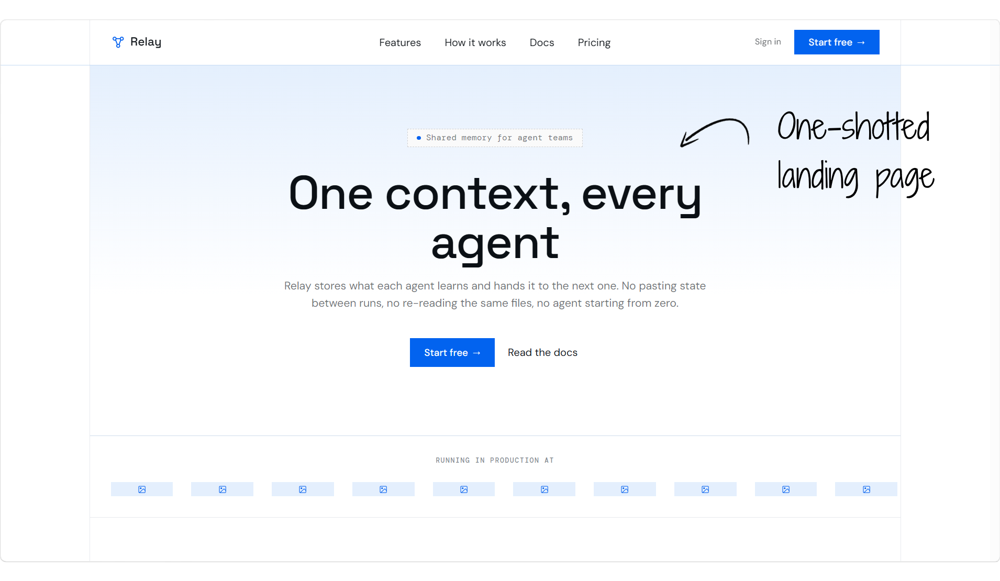

<p align="center">
  <picture>
    <source media="(prefers-color-scheme: dark)" srcset="assets/banner-dark.png">
    
  </picture>
</p>

<p align="center">
  <em>Your agent just got scissors.</em>
</p>

<br>

<p align="center">
  
  
  
  
</p>

<br>

<p align="center">
  
  
</p>

<br>

## What It Does

SnipCode reads what a page is actually made of, and cuts any single element out of it as clean
code. This is the Claude Code plugin, so your agent does the pointing.

It hands an agent two things it cannot get on its own.

1. **Take a whole design.** Name a page. Back come its real design tokens, the colors, fonts,
   spacing, radii, and shadows, plus a layout blueprint. Your agent redesigns against a
   measurement instead of a memory.

2. **Take a component.** Name a page and an element. Back comes self contained code: the markup
   plus one stylesheet, fonts and images inlined. HTML, JSX, Tailwind, or Vue.

SnipCode reads the styles the browser actually painted, not the ones written in the markup, so
the result matches what you saw.

Nothing goes to a model. Every judgment call stays with the agent: which element to take, what to
name it, how to make it yours.

There is also a [Chrome extension](https://github.com/micahtid/snip-code) if you would rather
point at elements yourself.

<br>

## Installing

Two pieces, because they ship on different channels. The Claude Code marketplace serves the skill.
npm publishes the CLI that the skill shells out to.

Installing the plugin does not bring the CLI along with it.

Inside Claude Code:

```
/plugin marketplace add micahtid/snip-code-cli
/plugin install snipcode@snipcode
```

Then the CLI and the browser, once per machine:

```bash
npm install -g snipcode           # Or let the skill reach it as: npx snipcode
npx playwright install chromium   # One time download
```

Chromium is its own step because Playwright ships the driver, not the browser. A "command not
found" or a missing browser error means one of those two lines, not a broken page.

<br>

## Using It

Just ask.

> Make this landing page look like linear.app.

> Snip the pricing card off stripe.com/pricing as Tailwind.

Your agent finds the element, drives the CLI, and hands back the code. Behind those two sentences:

```bash
snipcode schema https://linear.app
snipcode candidates https://stripe.com/pricing
snipcode extract https://stripe.com/pricing --selector ".PricingCard" --format tailwind
```

The first command measures a whole design. The second maps a page's elements. The third cuts the
one your agent picked.

Three commands, and that is the entire surface.

<br>

## Commands

Every command prints one JSON object to stdout. Errors are JSON too, `{ error: { code, message } }`
with a nonzero exit code, so an agent never has to read prose.

Files land under `--out`, which defaults to `./snipcode-out`.

| Command | What it does | Writes |
| --- | --- | --- |
| `schema <url>` | The blueprint. Design tokens and page layout, stamped with the version and time that made them. | `schema.json` and `schema.md`. |
| `candidates <url>` | The map. Every element worth aiming at: controls, headings, landmarks, and one stand in per repeated block. Each one carries a durable selector, its text, and its rect. | A full page screenshot. |
| `extract <url> --selector "<css>"` | The cut. One element, one self contained artifact. Add `--format html\|jsx\|tailwind\|vue`. | Markup plus a stylesheet. |

Two things worth knowing.

- Feed `--expect-text` and `--expect-rect` from a candidate into `extract`. If the page moved under
  you, it fails loudly with `PAGE_SHIFTED` rather than cutting the wrong element quietly.

- Site builders like Framer and Wix keep their real styling out of the DOM. SnipCode will not guess
  at it. It hands back a screenshot crop of the element instead, so your agent can rebuild it by
  eye, which is the one job the pipeline cannot do.

<br>

## Errors

Every failure is the same envelope, `{ error: { code, message } }`, with exit code 1. The code is
the part to branch on.

| Code | Means |
| --- | --- |
| `MISSING_URL` | No `<url>` was given. |
| `BAD_URL` | The `<url>` was not http or https. A bare host is fine (`example.com` loads as `https://example.com`); `file:`, `data:`, and the rest are refused, so SnipCode cannot be aimed at a local file. |
| `UNKNOWN_COMMAND` | Not one of `candidates`, `extract`, `schema`. |
| `UNKNOWN_FLAG` | A flag that does not exist, usually a typo. Names the flag. |
| `MISSING_SELECTOR` | `extract` was called without `--selector`. |
| `BAD_FORMAT` | `--format` was not one of `html`, `jsx`, `tailwind`, `vue`. |
| `BAD_EXPECT_RECT` | `--expect-rect` was not JSON with all of `x`, `y`, `w`, `h` as numbers. |
| `SELECTOR_INVALID` | The selector is not valid CSS. |
| `SELECTOR_NO_MATCH` | The selector matched nothing on the loaded page. |
| `PAGE_SHIFTED` | The element no longer matches `--expect-text` or `--expect-rect`. Re-run `candidates`. |
| `EXTRACT_FAILED` | The pipeline could not finish on that element. |
| `BLOCKED` | The page is a bot wall or consent gate. A screenshot is written so you can see it. |
| `RUNNER_ERROR` | The browser could not load the page: DNS, timeout, or a missing Chromium. |
| `FATAL` | Anything unhandled. |

<br>

## How The Code Is Organized

```
core/            The in page pipeline, bundled to one injectable IIFE
runner/          The Node host: Playwright Chromium, navigation, waits, injection
cli/             Arg parsing, command dispatch, schema.md rendering, the file generator
instructions/    One source of agent facing guidance, reused in the skill, --help, and JSON output
skill/           The Claude Code plugin: skill files plus .claude-plugin/plugin.json
.claude-plugin/  marketplace.json, which points the marketplace at skill/
test/            End to end CLI tests, unit tests, golden snapshots, and the fidelity bench
```

`core/` knows only a `Host` interface: CDP commands and cross origin fetch. The runner implements
that interface over a Playwright `CDPSession`. Holding that line is what keeps `core/` free of
Playwright.

Both `skill/skills/*/SKILL.md` and `skill/.claude-plugin/plugin.json` are generated, from
`instructions/guidance.ts` and `package.json`. The test suite fails if either drifts from its
source, so neither is edited by hand.

<br>

## Developing

```bash
npm install
npx playwright install chromium
npm run verify          # The whole gate: typecheck, build, unit, end to end, golden, fidelity
```

`npm run verify` is what CI runs, so a green local run means a green pull request. The pieces run
on their own too:

```bash
npm run typecheck       # Typechecks core (browser) and runner plus CLI (Node)
npm run build           # Builds the core IIFE plus the Node CLI bundle
npm run gen:skill       # Rebuilds the skill files and the plugin manifest
npm test                # Builds, then unit, end to end, golden, and fidelity
npm run test:golden -- --update       # Rewrites the golden baselines for this platform
npm run verify:comments -- --record   # Run before a comment only pass, then again after

claude --plugin-dir ./skill           # Loads the plugin locally so you can test it
```

The suite also holds the house rules: no module unreachable from an entry point, no em or en
dashes, a comment share ceiling per directory, and a size warning on any shipped module past 400
lines.

Golden snapshots live under `test/golden/<platform>/` because they carry text box geometry, and
every operating system resolves `system-ui` to a font with different metrics. A platform with no
committed baseline is reported and skipped rather than failed.

Contributions are welcome. [CONTRIBUTING.md](./CONTRIBUTING.md) has the house rules the suite
enforces. Open an issue at https://github.com/micahtid/snip-code-cli/issues to report a bug or
suggest a feature, and see [SECURITY.md](./SECURITY.md) to report a vulnerability privately.

<br>

## License

[MIT](./LICENSE)
